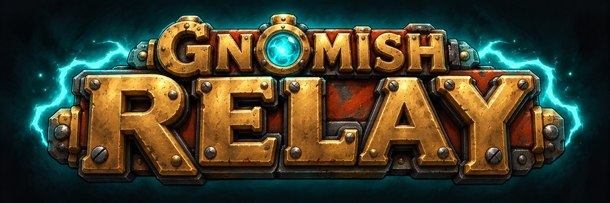

<p align="center">
  
</p>

<p align="center"><b>Stay productive IRL while you grind in Azeroth.</b></p>

Gnomish Relay puts your AI coding agent in a chat window inside World of Warcraft. Send
Claude Code or Codex a task, keep questing, and read the result when it's done. The agent
works on your own computer, in your own projects, the same way it does in your terminal.

## Requirements

- **WoW: Forever**, and the [CurseForge app](https://www.curseforge.com/download/app).
- **A coding agent**, installed and logged in on your computer:
  [Claude Code](https://docs.anthropic.com/en/docs/claude-code), Codex, or any agent that
  speaks the Agent Client Protocol (ACP).
- **Linux, macOS, or Windows.**

## Install

Gnomish Relay has two parts: the addon, from CurseForge, and a small desktop app that runs
your agents. To install both:

1. **Install the addon** from CurseForge: <https://www.curseforge.com/projects/1719624>.
2. **Close WoW.**
3. **Install the desktop app** with one command:
   - Linux and macOS:
     ```sh
     curl -fsSL https://raw.githubusercontent.com/eserilev/gnomish-relay/main/scripts/install.sh | sh
     ```
   - Windows (PowerShell):
     ```powershell
     irm https://raw.githubusercontent.com/eserilev/gnomish-relay/main/scripts/install.ps1 | iex
     ```
4. **Let setup finish.** It asks no questions about folders. It finds WoW and your code
   folders, such as `~/code`, and says where agents can work. With more than one WoW, it
   uses the one you played last. To use another one, run
   `gnomish-relay setup --wow <folder>`. If WoW isn't installed yet, setup does the rest,
   and tells you to start WoW once and run `gnomish-relay setup` again.
5. **Start WoW** and type `/relay`. To work in another folder, pick it in the game, then
   click **Approve** on your desktop. You approve each new folder once.

### Check that it works

Run `gnomish-relay status`. It shows `Desktop app: running`, your agent, and
`Sandbox: bwrap` (Linux) or `sandbox-exec` (macOS). In the game, the top of the
Gnomish Relay window says **Connected**.

If a line shows a problem, it also says how to fix it. See also
[Troubleshooting](#troubleshooting).

<details>
<summary>What the installer does</summary>

- It downloads the desktop app for your OS and checks its SHA-256 sum.
- It runs `gnomish-relay setup --autostart`. Setup finds the game, makes a key that only
  your computer has, writes its settings file `config.toml`, and starts the desktop
  app each time you log in.
- Setup asks no questions about folders. With more than one WoW, it uses the one you
  played last, and says so. With no WoW yet, it does everything else, and ends with
  "WoW not found. Start WoW once, then run gnomish-relay setup."
- Setup uses the agents it finds on your computer: `claude`, `codex`, `gemini`, `qwen`,
  `opencode`, `goose`, and the other ACP agents in `SPEC.md` 9.2.
- If the addon is missing or too old, setup ends with a line that says what to get or
  update in the CurseForge app. The desktop app never installs the addon itself.
- You can run it again at any time. It leaves alone whatever already works.
- To install without the login service, add `--no-autostart`:
  `curl -fsSL …/install.sh | sh -s -- --no-autostart`.

</details>

### Windows: the Linux sandbox (experimental)

On Windows, the desktop app can run in WSL2, Windows' built-in Linux. Every command from
Claude Code then runs in the same sandbox as on Linux. WoW stays on Windows. This setup is
new and not yet tested on many PCs.

To use it, run the Windows install command with `-Wsl`:

```powershell
& ([scriptblock]::Create((irm https://raw.githubusercontent.com/eserilev/gnomish-relay/main/scripts/install.ps1))) -Wsl
```

- The first time, the installer turns on WSL2 and installs Ubuntu. Windows asks for admin
  rights once, and then you restart. The installer continues after you sign in. Ubuntu
  asks you to pick a Linux user name and password.
- It installs the sandbox (`bubblewrap`) and Claude Code in Ubuntu, and opens Claude once
  so you can log in. For Codex, install it in Ubuntu, then run `gnomish-relay setup` there.
- Keep your projects in Ubuntu, for example `~/code`. Projects on `C:` work too, but
  they're much slower. In the game, the folder list shows Linux paths.
- The desktop app starts when you sign in to Windows. To check it, open Ubuntu from the
  Start menu and run `gnomish-relay status`. Run every `gnomish-relay` command there.
- Approvals show as a Windows message box.

## How it works

1. **Type a task** in the Gnomish Relay window (`/relay`), or straight from the chat box
   with `/ai <task>`.
2. **Your agent gets to work** on your computer, in the project folder you picked.
3. **The reply comes back in the game**, with live progress while it works and a
   whisper-style message in your chat when it's done.

Along the way you get approval popups, a list of the files that changed with **Commit**
and **Revert** buttons, a branch of its own for each chat, one-click suggestions in a new
chat, test and CI results under each reply, and the tokens each run used (with the cost
when you pay with an API key).

## Add an agent

Setup adds the agents it finds when it runs. To add one later, edit `config.toml`:

| OS | Where `config.toml` is |
|---|---|
| Linux | `~/.config/gnomish-relay/config.toml` |
| macOS | `~/Library/Application Support/gnomish-relay/config.toml` |
| Windows | `%APPDATA%\gnomish-relay\config.toml` |

1. Add an entry for the agent:
   - **Claude Code:**
     ```toml
     [agents.claude]
     kind = "claude"
     command = ["claude"]
     permission = "auto-edit"
     ```
   - **Codex:**
     ```toml
     [agents.codex]
     kind = "codex"
     command = ["codex"]
     permission = "auto-edit"
     ```
   - **Any ACP agent**, for example Gemini CLI:
     ```toml
     [agents.gemini]
     kind = "acp"
     command = ["gemini", "--acp"]
     permission = "auto-edit"
     ```
2. Test it: `gnomish-relay check-agent gemini`. It prints the agent's name and version.
3. Load it: `gnomish-relay restart`.

The agent now shows in the agent list of a new chat.

## Control what an agent can do

### Permission levels

`permission` sets the most a chat from the game can do:

| Level | Edits files in the chat's folder | Runs commands |
|---|---|---|
| `ask` | Asks you first | Asks you first |
| `auto-edit` (default) | On its own | On its own inside the sandbox. Asks you first for risky commands. |

`permission = "full-auto"` works like `auto-edit`. Full-auto is for one chat at a time: see
[Full-auto for one chat](#full-auto-for-one-chat).

At `auto-edit`, risky commands still ask you first: commands that run other commands
(`xargs`, `sh`, `python`), network tools (`curl`, `ssh`), `git push`, publishing (`npm publish`),
`rm -r`, scripts such as `./build.sh`, and tools that download and run code (`npx`, `docker`).
Every command asks when there's no sandbox: on Windows, on Linux without a working `bwrap`, and
with Codex or other ACP agents (see [How your computer is protected](#how-your-computer-is-protected)).

Some actions ask on your desktop at `ask` and `auto-edit`: for example reading `~/.ssh`,
writing outside the chat's folder, or a chat in a new folder. A dialog with **Approve** and
**Deny** opens. Agents never work in your whole home folder or in a hidden folder.

### Full-auto for one chat

Click the permissions next to the agent name in the chat header, or press **Shift+Tab** in
the message box, and pick **full-auto**. The header then shows it in orange-red.

The first message at full-auto asks you once on your desktop: "Let claude run anything with
no question in the chat ...? It stays in the sandbox". After you approve, that chat never
asks again, even after a restart or `/reload`, until you switch it back or pick another
folder.

At full-auto the agent runs every command and every edit in the chat's folder without
asking, also `git push`, `rm -rf`, and `npx`. It still can't write outside the chat's folder,
read your secrets (`~/.ssh`, `.env` files, tokens), or reach sites that the sandbox doesn't
allow. Those just fail. A prompt hidden in a file can make the agent push, publish, or change
files such as `.git/config` that git runs later on your computer. Use full-auto only in
chats you trust.

Full-auto works with Claude Code on a computer with the sandbox (Linux with `bwrap`, or
macOS). Other agents run at `auto-edit`. To turn full-auto off for every chat, add
`allow_full_auto = false` to `config.toml`.

### Answer a desktop request in a terminal

If your computer shows no dialog, answer in a terminal:

```sh
gnomish-relay approve          # list the requests waiting for you
gnomish-relay approve <id>     # approve one
gnomish-relay deny <id>        # deny one
```

### Let trusted commands run without asking

At `auto-edit`, commands that match a rule run without asking. With Claude
Code in the sandbox, most commands already run on their own at `auto-edit`, so a rule matters
mostly for Codex and for scripts such as `./build.sh`.

- **From the game:** click **Always allow** on a popup.
- **In `config.toml`:**
  ```toml
  [allow]
  commands = ["cargo test *"]
  ```

To see or remove your rules, open Settings in the game, or run `gnomish-relay rules`.

### How your computer is protected

Where a command runs depends on your OS and your agent (`SPEC.md` 6.6.4):

| OS | Commands from Claude Code | Commands from Codex |
|---|---|---|
| Linux | A `bwrap` sandbox. Needs `bubblewrap` installed. | Codex's own sandbox |
| macOS | A Seatbelt sandbox (`sandbox-exec`). | Codex's own sandbox |
| Windows | No sandbox yet: every command asks you first, even one you always allow. | Codex's own Windows sandbox |
| Windows with WSL2 (experimental) | A `bwrap` sandbox, as on Linux. | Codex's own sandbox |

- **Inside the sandbox**, a command can write only to the chat's folder and a temp folder.
  It can't see `~/.ssh`, the desktop app's keys, or your other credential folders. It can
  only reach the package hosts you allow. That's why Claude Code's commands run on their own
  at `auto-edit`: the sandbox, not a popup, keeps them in bounds.
- **Linux without a working `bwrap`** acts like Windows: every command asks.
- **On macOS**, a command can read (never write) each repository's `.git/config`, because git
  can't run without it. If a remote URL there holds a token, keep the token in a credential
  helper instead.
- **Codex's sandbox** lets a command read the whole disk, `~/.ssh` included, but gives it no network.
  So Codex's commands ask you first at `auto-edit`, unless a rule allows them.
- **Other ACP agents** run their commands themselves, with no sandbox, so every tool call
  asks you first.
- **On Windows**, use Codex for commands that run without asking, or try the experimental
  [WSL2 setup](#windows-the-linux-sandbox-experimental). Under WSL2 the sandbox also hides the
  credential folders of your Windows home, and no agent can change your Windows drives
  outside its chat folder.

## Get notifications from your terminal

If you also run Claude Code or Codex in a normal terminal, Gnomish Relay can tell you in the
game when a session needs you or finishes long work.

1. Run:
   ```sh
   gnomish-relay hooks install
   ```
   It adds a hook to `~/.claude/settings.json` and `~/.codex/hooks.json`, for each of
   `claude` and `codex` that it finds. It keeps your own hooks, and backs up each file first.
2. Restart the Claude Code and Codex sessions that are open.
3. The next time Codex starts, it asks you to trust the new hooks. Trust them.

The first notification can take up to 10 minutes. To check at once, type `/relay poll` in
the game.

When a notification comes in, a bell shows at the edge of your minimap, with a chat line
and a sound. A notification never runs anything: you answer in the terminal.

- To choose chat lines, sounds, or banners, open Settings in the game.
- To check the hooks, run `gnomish-relay hooks status`.
- To turn notifications off, run `gnomish-relay hooks remove`.

## Update

- **The addon:** the CurseForge app keeps it up to date.
- **The desktop app:** run `gnomish-relay update`. It installs the latest version and
  restarts itself. Then type `/reload` in WoW.

## Troubleshooting

First, run `gnomish-relay status`. It checks every part, and says what to fix.

| What you see | Likely cause | Fix |
|---|---|---|
| Gnomish Relay isn't in the AddOns list, or `status` says "Addon: missing" | The addon isn't installed. | Install it from [CurseForge](https://www.curseforge.com/projects/1719624), then restart WoW. |
| `gnomish-relay status` says "Addon: too old" | CurseForge hasn't updated the addon yet. | Update Gnomish Relay in the CurseForge app, then restart WoW. |
| A "Gnomish Relay Setup" window instead of the chat | The desktop app isn't installed, or WoW started before it. | Follow [Install](#install), then restart WoW. |
| "Desktop app offline", or "the desktop app isn't running" | The desktop app stopped. | Run `gnomish-relay restart`. |
| "Your game and the desktop app don't match" | The key changed, for example after a new setup. | Run `gnomish-relay setup`, then type `/reload` in WoW. |
| "Some addon files are missing" | The reply files of the desktop app are gone or turned off. | Close WoW, run `gnomish-relay install`, and keep the `GnomishRelay_…` addons turned on. |
| "Can't take screenshots" | The disk is full, or the `Screenshots` folder isn't writable. | Free up some disk space, check WoW's `Screenshots` folder, then type `/reload`. |
| "Another addon is in the way of the colored bar" | Another addon takes screenshots too. | Turn that addon off, then type `/reload`. |
| "1 message is waiting. Reload to send it." | The message couldn't go out by screenshot, so it waits in WoW's saved file. WoW writes that file only at a reload. | Click **Reload**. |
| "Claude needs you to log in again" | Your Claude Code login expired. | On your computer, run `claude` and log in. |
| A reply says "That agent isn't in config.toml" | The chat uses an agent you removed. | Pick another agent in Settings, or [add the agent](#add-an-agent). |
| A colored bar flashes in the top-left corner | Nothing is wrong. | That's how your messages reach the desktop app. After your first message, it shrinks to a thin line. |
| The colored bar stays big | Your game blurs, scales, or recolors thin lines. | Nothing to do: messages still get through. `gnomish-relay status` says why. To get the thin line, fix that setting, then type `/reload`. |

### Where the log is

| Setup | Log |
|---|---|
| Linux, with the login service | `journalctl --user -u gnomish-relay` |
| macOS | `~/Library/Logs/gnomish-relay.log` |
| Any OS, started by hand | `bridge.log` in the desktop app's data folder |

The desktop app also keeps a detailed log in `logs/` in its data folder. It never holds your
messages, the agent's replies, or your keys.

Still stuck? Run `gnomish-relay report`. It saves one file with your recent log, status, and
settings, with keys and tokens removed. [Open an issue](https://github.com/eserilev/gnomish-relay/issues)
and attach that file. Nothing is uploaded unless you attach it.

## Contributing

To report a bug, build from source, or submit a change, see
[CONTRIBUTING.md](CONTRIBUTING.md).

## License

MIT. See [LICENSE](LICENSE).
