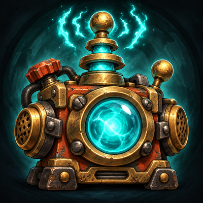

<p align="center">
  
</p>

<h1 align="center">Gnomish Relay</h1>

<p align="center"><b>Stay productive IRL while you grind in Azeroth.</b></p>

Gnomish Relay puts your AI coding agent in a chat window inside World of Warcraft. Send
Claude Code or Codex a task, keep questing, and read the result when it's done. The agent
works on your own computer, in your own projects, the same way it does in your terminal.

## Requirements

- **WoW: Forever**, and the [CurseForge app](https://www.curseforge.com/download/app).
- **A coding agent**, installed and logged in on your computer:
  [Claude Code](https://docs.anthropic.com/en/docs/claude-code), Codex, or any agent that
  speaks the Agent Client Protocol (ACP).
- **Linux, macOS, or Windows.**

## Install

Gnomish Relay has two parts: the addon, from CurseForge, and a small desktop app that runs
your agents. To install both:

1. **Install the addon** from CurseForge: <https://www.curseforge.com/projects/1719624>.
2. **Close WoW.**
3. **Install the desktop app** with one command:
   - Linux and macOS:
     ```sh
     curl -fsSL https://raw.githubusercontent.com/eserilev/gnomish-relay/main/scripts/install.sh | sh
     ```
   - Windows (PowerShell):
     ```powershell
     irm https://raw.githubusercontent.com/eserilev/gnomish-relay/main/scripts/install.ps1 | iex
     ```
4. **Answer the setup questions.** Setup finds WoW, then asks which folders your agents
   can work in.
5. **Start WoW** and type `/relay`.

### Check that it works

Run `gnomish-relay status`. It shows `Desktop app: running`, your agent, and
`Sandbox: bwrap` (Linux) or `sandbox-exec` (macOS). In the game, the top of the
Gnomish Relay window says **Connected**.

If a line shows a problem, it also says how to fix it. See also
[Troubleshooting](#troubleshooting).

<details>
<summary>What the installer does</summary>

- It downloads the desktop app for your OS and checks its SHA-256 sum.
- It runs `gnomish-relay setup --autostart`. Setup finds the game, makes a key that only
  your computer has, writes its settings file `config.toml`, and starts the desktop
  app each time you log in.
- Setup uses the agents it finds on your computer: `claude`, `codex`, `gemini`, `qwen`,
  `opencode`, `goose`, and the other ACP agents in `SPEC.md` 9.2.
- You can run it again at any time. It leaves alone whatever already works.
- To install without the login service, add `--no-autostart`:
  `curl -fsSL …/install.sh | sh -s -- --no-autostart`.

</details>

## How it works

1. **Type a task** in the Gnomish Relay window (`/relay`), or straight from the chat box
   with `/ai <task>`.
2. **Your agent gets to work** on your computer, in the project folder you picked.
3. **The reply comes back in the game**, with live progress while it works and a
   whisper-style message in your chat when it's done.

Along the way you get approval popups, a list of the files that changed with **Commit**
and **Revert** buttons, a branch of its own for each chat, quick-action buttons, test
and CI results under each reply, and what each run cost.

## Add an agent

Claude Code only needs the `claude` program, and Codex only needs `codex`:

```toml
[agents.claude]
kind = "claude"
command = ["claude"]
permission = "auto-edit"

[agents.codex]
kind = "codex"
command = ["codex"]
permission = "auto-edit"
```

Any ACP agent is one entry in `config.toml`:

```toml
[agents.gemini]
kind = "acp"
command = ["gemini", "--acp"]
permission = "auto-edit"
```

Then run `gnomish-relay check-agent gemini` to test it, and `gnomish-relay restart` to load it.

## Stay in control

`permission` is the most a chat from the game can do:

- **`ask`**: the agent asks in the game before every edit and every command.
- **`auto-edit`**: it edits files in the chat's folder on its own, and asks before each command.
- **`full-auto`**: it also runs commands on its own, inside the sandbox.

Anything riskier asks on your desktop, not just in the game. Reading `~/.ssh` or writing
outside the chat's folder opens a dialog with **Approve** and **Deny**. No dialog on your
computer? Answer in a terminal:

```sh
gnomish-relay approve          # list the requests waiting for you
gnomish-relay approve <id>     # approve one
gnomish-relay deny <id>        # deny one
```

Commands you trust can run without asking, at `auto-edit` and `full-auto`:

```toml
[allow]
commands = ["cargo test *"]
```

Or click **Always allow** on a popup in the game. You'll find your rules in Settings, or
with `gnomish-relay rules`.

### How your computer is protected

Each command from the game runs in a sandbox, depending on your OS (`SPEC.md` 6.6.4):

| OS | Commands from Claude | Commands from Codex |
|---|---|---|
| Linux | Each command runs in a `bwrap` sandbox. Install `bubblewrap`. | Codex's own sandbox |
| macOS | Each command runs in a Seatbelt sandbox (`sandbox-exec`). | Codex's own sandbox |
| Windows | No sandbox yet, so every command asks in the game, even one you always allow. | Codex's own Windows sandbox |

- The sandbox lets a command write only to the chat's folder and a temp folder. It hides
  `~/.ssh`, the desktop app's own keys, and your other credential folders. It only lets a
  command reach the package hosts you allow.
- On Linux without a working `bwrap`, it acts like Windows: every command asks.
- Codex's sandbox lets a command read the whole disk, `~/.ssh` included, but gives it no network.
- Other ACP agents run their commands themselves, with no sandbox, so each of their tool
  calls asks you first.
- On Windows, use Codex for commands that run without asking, or run Claude and the desktop
  app under WSL2, where the desktop app uses `bwrap` just like on Linux.

## Notifications from your terminal

Running Claude Code or Codex in a normal terminal? Get pinged in the game when it needs
you or finishes a long task. Run this once:

```
gnomish-relay hooks install
```

It adds a hook to `~/.claude/settings.json` and `~/.codex/hooks.json` for each of `claude`
and `codex` on your `PATH`. It keeps your own hooks and backs up each file first. Then
restart any sessions that are open. The next time Codex starts, it asks you to trust the
new hooks: trust them to get notifications.

The first notification can take up to 10 minutes. To check right away, type `/relay poll`
in the game.

While a notification waits, a bell shows at the edge of your minimap, with a chat line
and a sound. A notification never runs anything: you answer in the terminal. Turn the
chat lines, sounds, or banners on or off in Settings. `gnomish-relay hooks status` tells
you whether notifications are on, and `gnomish-relay hooks remove` turns them off.

## Update

- **The addon:** the CurseForge app keeps it up to date.
- **The desktop app:** run `gnomish-relay update`. It installs the latest version and
  restarts itself. Then type `/reload` in WoW.

## Troubleshooting

Start with `gnomish-relay status`. It checks every part and tells you what to do next.

| You see | Do this |
|---|---|
| "Desktop app offline", or "the desktop app isn't running" | Run `gnomish-relay restart`. |
| "Your game and the desktop app don't match" | Run `gnomish-relay setup`, then type `/reload` in WoW. |
| "Some addon files are missing" | Close the game, then run `gnomish-relay install`. |
| "Can't take screenshots" | Free up some disk space, check WoW's `Screenshots` folder, then type `/reload`. |
| "Another addon is in the way of the colored bar" | Turn off other addons that take screenshots, then type `/reload`. |
| A colored bar flashes in the top-left corner | That's normal: it's how your messages reach the desktop app. |
| "1 message is waiting. Reload to send it." | Click **Reload**. |
| "Claude needs you to log in again" | On your computer, run `claude` and log in. |
| A reply says "That agent isn't in config.toml" | Pick another agent in Settings, or add it to `config.toml` and run `gnomish-relay restart`. |

The desktop app keeps its log in `bridge.log` in its data folder. On macOS it's
`~/Library/Logs/gnomish-relay.log`, and with the Linux service,
`journalctl --user -u gnomish-relay`.

Still stuck? [Open an issue](https://github.com/eserilev/gnomish-relay/issues).

## Build from source

`cargo run -q --bin gnomish-relay -- setup`. For addon work, `scripts/dev-link.sh` links
`addon/GnomishRelay` into the game first. `CLAUDE.md` has the rules for the code, and
`SPEC.md` has the design. `VERIFICATION.md` covers the proofs.

The checks use these tools:

| Tool | For | Script |
|---|---|---|
| Rust stable, with `rustfmt` and `clippy` | the build, the lints, and the tests | `check-fast.sh`, `check-all.sh` |
| `stylua` and `selene` | the format and the lints of the addon | `check-fast.sh`, `check-all.sh` |
| `python3` and `git` | the WoW API gate | `wow-api.sh`, `selftest-api.sh`, `check-all.sh` |
| `cargo-deny` | the licenses and advisories of the dependencies | `check-all.sh` |
| Charon and Aeneas, at the commits in `proofs/TOOLS`, in `~/verif` or in `CHARON_DIR` and `AENEAS_DIR` | the translation of `protocol` to Lean | `extract.sh`, `check-proofs.sh` |
| Lean through `elan`, at the version in `proofs/lean-toolchain` | the proofs | `check-proofs.sh` |
| Quint (`npm install -g @informalsystems/quint`) | the models of the transport | `check-model.sh` |
| Rust nightly and `cargo-fuzz` | the fuzz targets | `fuzz.sh` |
| `cargo-llvm-cov` | the coverage gates | `check-coverage.sh` |

For a quick loop, run `scripts/check-fast.sh`. Before each commit, run `scripts/check-all.sh`.

### After a game patch

The tests run the addon in a fake game. A self-test addon measures the real game, so the
fake game keeps acting like the real one (`SPEC.md` 14.3). Run it after each client patch:

1. Close the game, and run `scripts/selftest-link.sh`.
2. Start the game and log in. Stay out of combat. When the chat says "done", type `/reload`.
3. In this folder, run `cargo run -q --bin gnomish-relay -- selftest collect`. Then run
   `cargo test`, and commit `tests/fixtures` and `tests/vectors`.

The first time, collect asks for one more `/reload`: the first session has no saved file
yet, so it can't see the load order. `scripts/selftest-link.sh --remove` takes the
self-test out of the game again.

## Maintainers: publish on CurseForge

A version tag (`v*`) starts `.github/workflows/curseforge.yml`. It builds the addon zip
with the shared transport files copied in, and uploads it with the BigWigs packager. The
zip holds only the `GnomishRelay` folder, never a key or the desktop app's addon files.

The setup is done once:

1. The CurseForge project exists. Its Project ID is 1719624.
2. The ID is in the `## X-Curse-Project-ID` line of `addon/GnomishRelay/GnomishRelay.toc`.
   A repository variable `CURSEFORGE_PROJECT_ID` on GitHub overrides it.
3. An API token from <https://authors.curseforge.com/#/settings/api-tokens> is the
   repository secret `CF_API_KEY` on GitHub.

Without the ID or the secret, the job still builds the zip, keeps it as an artifact of the
run, and skips the upload. To test the zip locally, run `scripts/package-addon.sh dist`.

## Credits

Gnomish Relay builds on the ideas of two earlier projects (`SPEC.md` 4):

- [chelinho139/wow-claude](https://github.com/chelinho139/wow-ai), now named `wow-ai`, by
  chelinho139, under the MIT license. It inspired the design of the addon and the transport.
  Gnomish Relay has no code from it.
- [0xInuarashi/wow-forever-codex](https://github.com/0xInuarashi/wow-forever-codex), by
  0xInuarashi. It measured the file-load rules of the Forever client and invented the
  pixel-out channel. Gnomish Relay uses its findings, not its code.

Code in the game window uses the JetBrains Mono font, under the SIL Open Font License 1.1.
Its license is in `addon/GnomishRelay/JetBrainsMono-OFL.txt`.

Gnomish Relay is under the MIT license. See `LICENSE`.
